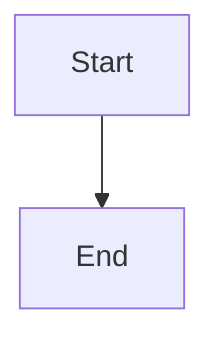

# MarkDoc GFM Test Document

## Heading Level 2

### Heading Level 3

This is a **bold** and *italic* and ***bold italic*** and ~~strikethrough~~ paragraph.

Here is `inline code` in a sentence.

- Unordered list item 1
- Unordered list item 2
  - Nested item

1. Ordered list item 1
2. Ordered list item 2

- [ ] Task item unchecked
- [x] Task item checked

> Blockquote text
> > Nested blockquote

---

```javascript
const hello = 'world'
console.log(hello)
```

| Column A | Column B | Column C |
|----------|:--------:|---------:|
| left     | center   | right    |
| data 1   | data 2   | data 3   |

[Link text](https://example.com)




---
title: Test Document
tags: [test, gfm]
---
