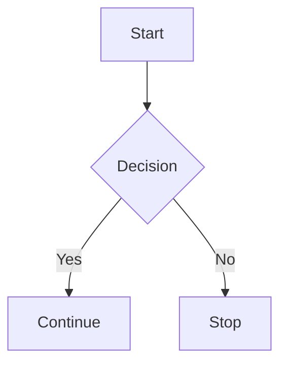
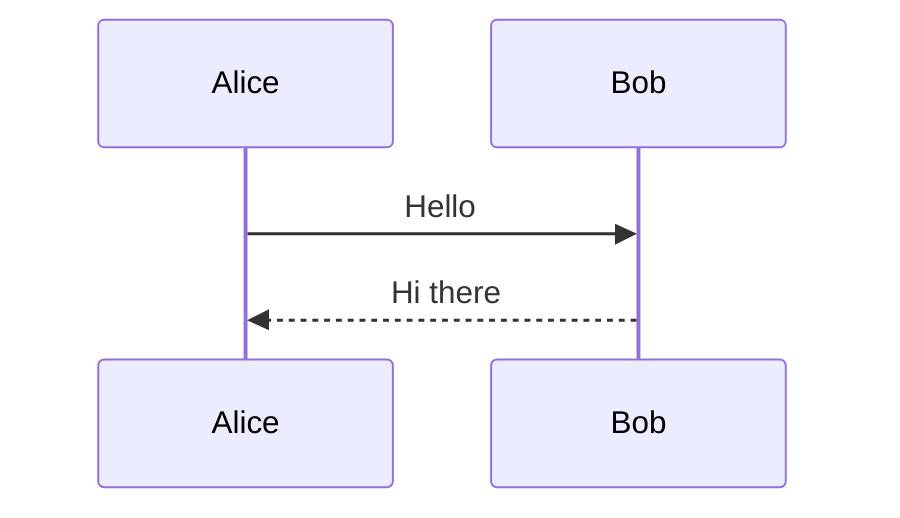
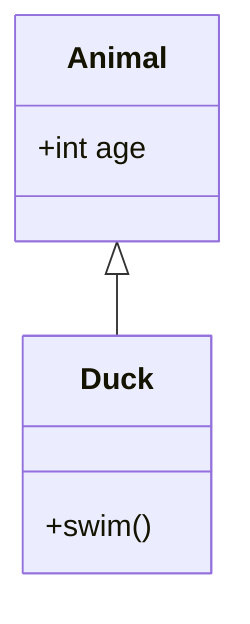
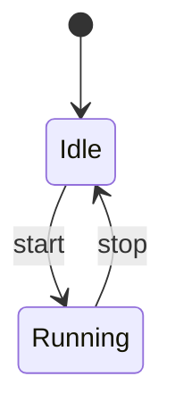
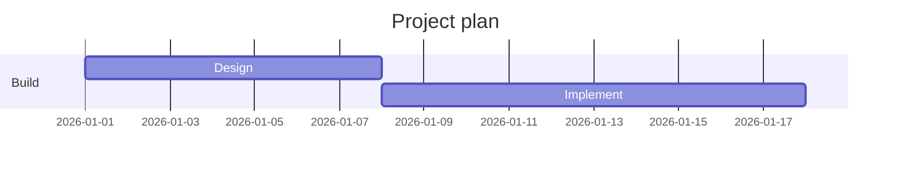
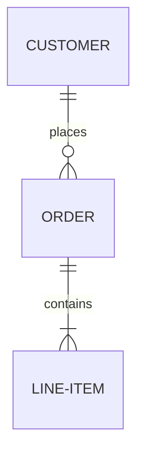

# Mermaid Diagrams

Valid Mermaid diagrams for integration and preview tests.

## Flowchart

```mermaid
graph TD
    A[Start] --> B{Decision}
    B -->|Yes| C[Continue]
    B -->|No| D[Stop]
```

## Sequence diagram

```mermaid
sequenceDiagram
    Alice->>Bob: Hello
    Bob-->>Alice: Hi there
```

## Class diagram

```mermaid
classDiagram
    Animal <|-- Duck
    Animal : +int age
    Duck : +swim()
```

## State diagram

```mermaid
stateDiagram-v2
    [*] --> Idle
    Idle --> Running : start
    Running --> Idle : stop
```

## Gantt chart

```mermaid
gantt
    title Project plan
    dateFormat YYYY-MM-DD
    section Build
    Design :a1, 2026-01-01, 7d
    Implement :after a1, 10d
```

## ER diagram

```mermaid
erDiagram
    CUSTOMER ||--o{ ORDER : places
    ORDER ||--|{ LINE-ITEM : contains
```
